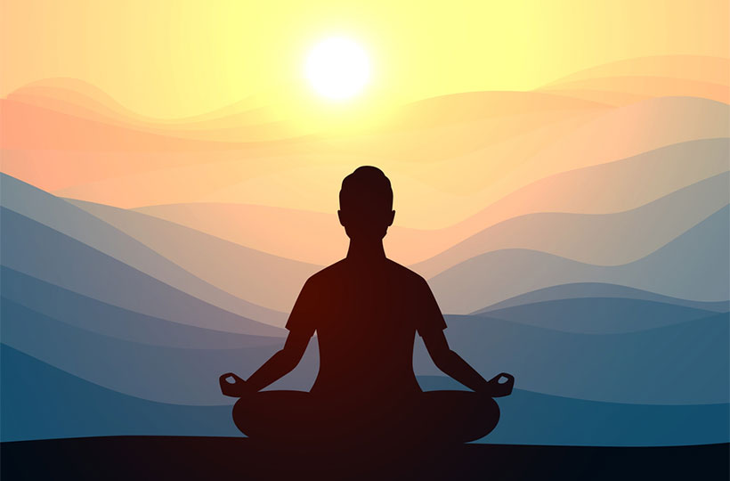

  

# 🪷 About DhyanBodh

> *Dhyan* (ध्यान) means meditation or profound contemplation, and *Bodh* (बोध) means awakening, understanding, or realization.

**DhyanBodh** is a digital sanctuary and knowledge repository dedicated to the exploration, preservation, and practice of ancient Indian philosophical traditions. It serves as a bridge between profound ancient wisdom and modern spiritual seekers.

### Our Vision

In a world increasingly driven by external distractions, the timeless teachings of the East offer a profound remedy—a journey inward. DhyanBodh aims to provide:

- **Clarity:** Distilling complex philosophical concepts from Vedanta, Buddhism, Jainism, and Yogic traditions into accessible insights.
- **Practice:** Offering practical guidance on *Sadhana* (spiritual practice), including meditation techniques, Pranayama, and ethical living.
- **Preservation:** Documenting stories, scriptures, and teachings from the sacred texts like the Pali Canon, Upanishads, and Itihasas.

---

### Who Is This For?

This space is designed for:

> [!info] **Seekers of Wisdom**
> If you are looking to deepen your understanding of Eastern philosophy, from the rigorous logic of the Nyaya school to the profound emptiness of Madhyamaka.

> [!info] **Practitioners & Meditators**
> If you seek practical advice and historical context for your practice. Understand *why* we practice, not just *how*.

> [!info] **The Curious Mind**
> If you find yourself asking fundamental questions about the nature of reality, suffering, and liberation.

---

### How to Navigate

Our articles, reflections, and translations are organized into interconnected notes. As a digital garden, these ideas will grow, connect, and evolve over time. 

You can explore the site through:
- **Folders:** Use the explorer on the left to navigate through specific traditions like Buddhism, Advaita Vedanta, or Dhyana Yoga.
- **Tags:** Filter content by specific concepts like `#mahayana`, `#sadhana`, or `#philosophy`.
- **The Graph:** Visualize the connections between different spiritual concepts and texts using the interactive graph view on the right side of the screen.

---

> [!quote] 
> *“You are what your deep, driving desire is. As your desire is, so is your will. As your will is, so is your deed. As your deed is, so is your destiny.”*
>  — Brihadaranyaka Upanishad

We invite you to explore, contemplate, and incorporate these teachings into your own journey toward inner peace and awakening. 
