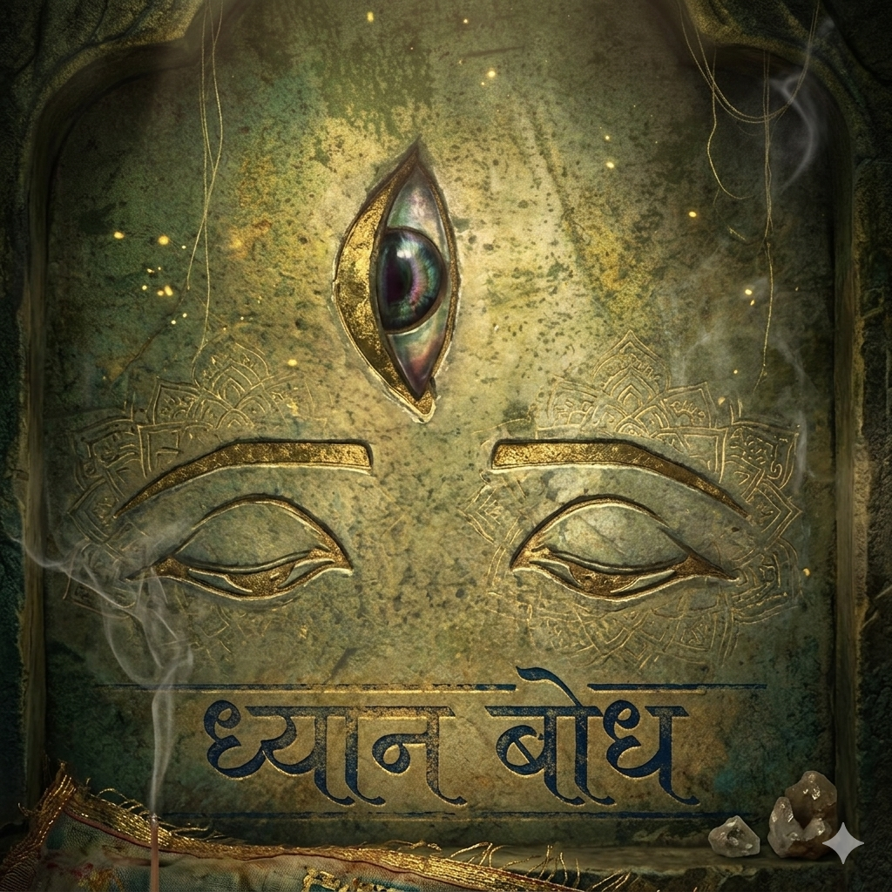

  
  <h2 style="margin-top: 1rem; font-weight: 600;">ध्यानबोध — <em>Your Journey to the Inner World</em></h2>

Welcome to **DhyanBodh**, a digital sanctuary dedicated to the profound teachings of ancient Indian philosophy, meditation (Dhyana), and spiritual awakening. Whether you are exploring the subtle nuances of Buddhism, delving into the depths of Vedanta, or seeking practical guidance for your Sadhana, you will find a wealth of knowledge here.

---

### 🧭 Explore the Wisdom

Navigate through the core traditions and concepts preserved in this digital ashram. 

> [!abstract] **Buddhist Paths**
> - **[Mahayana](/tags/mahayana)**: The Great Vehicle of compassion and the Bodhisattva ideal.
> - **[Theravada](/tags/theravada)**: The Way of the Elders, emphasizing individual liberation and the Pali Canon.

> [!abstract] **Vedic & Yogic Wisdom**
> - **[Vedic Literature](/tags/vedic)**: The foundational sacred texts of Sanatana Dharma.
> - **[Puranas](/tags/purana)**: The ancient lore and mythological epics.
> - **[Itihasa](/tags/itihasa)**: The historical epics (Ramayana and Mahabharata).
> - **[Philosophy (Darshana)](/tags/philosophy)**: The systematic investigations into the nature of reality.

> [!abstract] **Other Traditions & Practices**
> - **[Jainism](/tags/jain)**: The path of Ahimsa (non-violence) and spiritual asceticism.
> - **[Sadhana](/tags/sadhana)**: Practical guides and reflections for daily spiritual practice.

---

### 🪷 Deepen Your Understanding

We invite you to read our thoughts, reflections, and analyses of sacred texts. 

- Head over to the **[About Us](/about)** page to learn more about the vision behind DhyanBodh.
- Explore the **Folders** on the left to read deep-dives into Hinduism, Buddhism, Bhakti, and more.
- Use the **Graph View** to see how these ancient ideas interconnect.

  <em>“Peace comes from within. Do not seek it without.” — Gautama Buddha</em>

